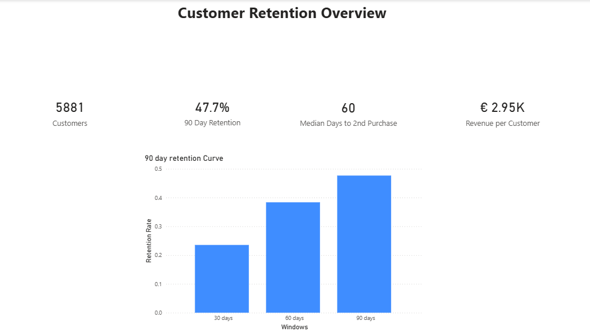
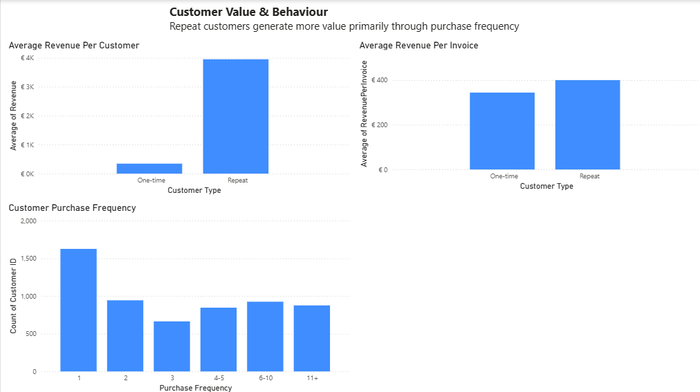
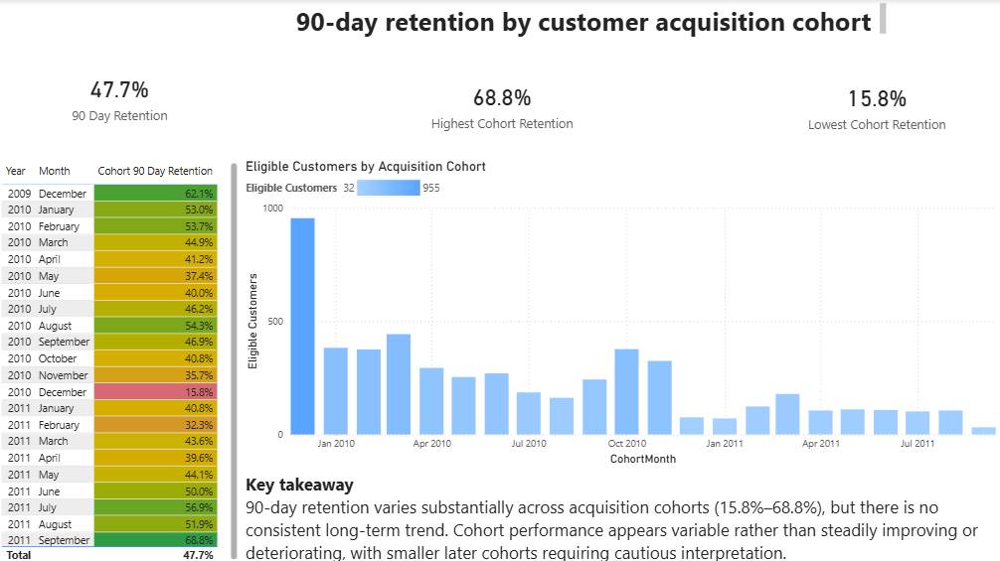

# Customer Retention & Value Analysis

Analysis of customer retention, purchase behaviour, and customer value for a UK online retailer using the UCI Online Retail II dataset.

## Business Question

How effectively does the retailer retain customers, and what drives the difference in value between one-time and repeat customers?

## Key Findings

- **47.7% of eligible customers made a second purchase within 90 days.**
- The median time to a second purchase was **60 days**.
- Repeat customers generated approximately **€3,952 per customer**, compared with **€345 for one-time customers**.
- Average revenue per invoice was much closer: approximately **€400 for repeat customers vs €345 for one-time customers**.
- This indicates that the large difference in customer value is driven primarily by **purchase frequency rather than substantially larger individual purchases**.
- 90-day retention varied considerably across acquisition cohorts, ranging from **15.8% to 68.8%**, with no consistent long-term trend.
- 
## Dashboard

### Customer Retention Overview

### Customer Value & Behaviour

### 90-Day Retention by Acquisition Cohort

## Methodology

- Removed **34,335 exact duplicate rows** from the raw dataset.
- Excluded **cancellation invoices** identified by invoice numbers beginning with `C`.
- Customer-level analysis was restricted to transactions with an identifiable **Customer ID**.
- Revenue was calculated as **Quantity × Price**.
- A customer was considered retained if they made a **second purchase within 90 days of their first purchase**.
- Customers whose first purchase occurred too close to the end of the dataset to allow a full 90-day observation period were excluded from the retention calculation.
- Acquisition cohorts were based on the **month of each customer's first purchase**.
## Tools

- Python
- pandas
- Power BI
- DAX
- GitHub

## Dataset

**UCI Online Retail II**

The dataset contains transactional records from a UK-based online retailer covering December 2009 to December 2011.

- **Source:** UCI Machine Learning Repository
- **Dataset:** Online Retail II
- **Records:** 1,067,371 transactions
- **Period:** December 2009 – December 2011
- **License:** CC BY 4.0
- **DOI:** 10.24432/C5CG6D

The dataset was accessed via Kaggle for analysis. The original dataset and documentation are maintained by the UCI Machine Learning Repository.
